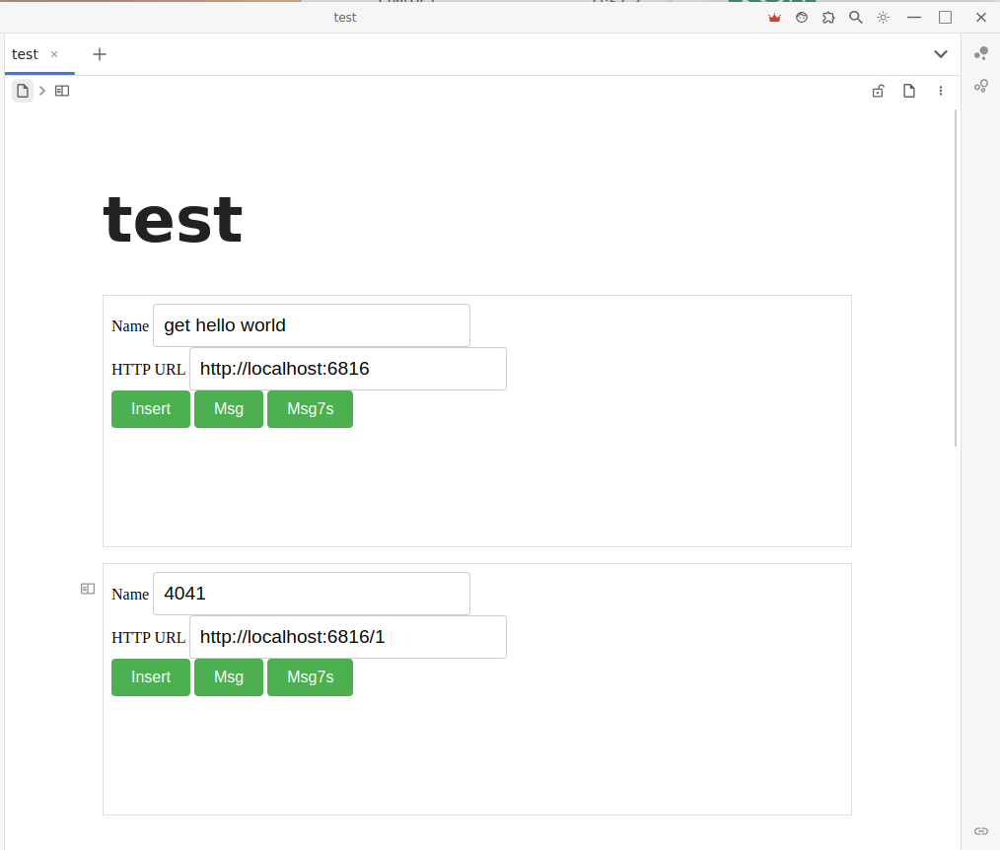

[中文](https://github.com/IAliceBobI/sy-httpget-widget/blob/main/README_zh_CN.md)

# Http Get Widget

This widget can be seen as a button placed within the content. It can initiate a Get request to extend the functionality of SY with the help of backend services.

As shown in the image:

> The content entered in each widget will be persisted.

> For deleted widgets, their persisted data will also be cleaned up when used by other widgets.