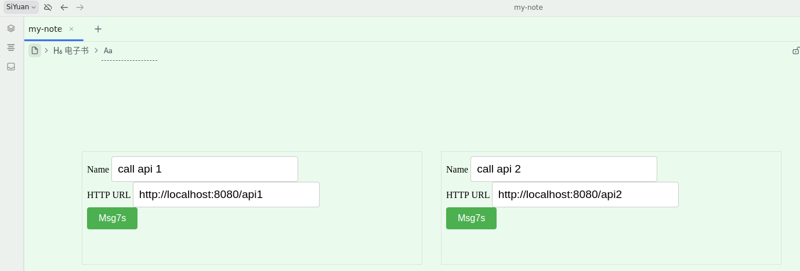

[English](https://github.com/IAliceBobI/sy-httpget-widget/blob/main/README.md)

# Http Get 挂件

此挂件可以看作是放在内容里的按钮。可以发起Get请求，配合后端服务对思源进行功能扩展。

**每个挂件所输入的内容都会持久化的。**

**对于删除了的挂件，其持久化的数据，也会在其它挂件使用时进行清理。**

# BUG反馈、建议

QQ群: 263961482

[或者到 Github 提交问题](https://github.com/IAliceBobI/sy-httpget-widget/issues)

[或者到官方论坛提交问题](https://ld246.com/tag/siyuan)

# 更新日志

## 2023-12-01

* 只保留一个按钮。

## 2023-11-30

* 修复bug。

## 2023-11-05

* 第一版。